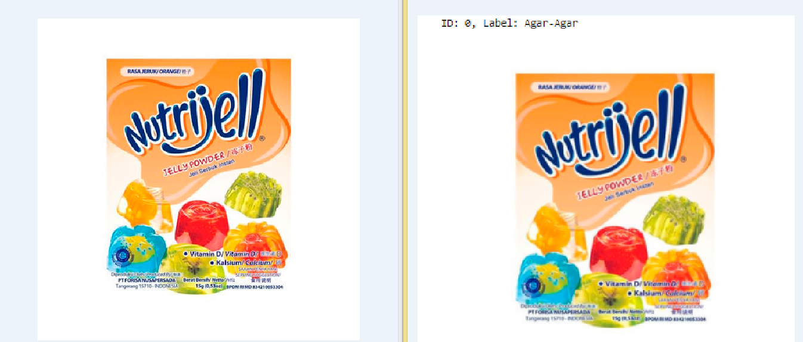
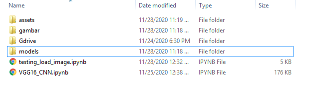
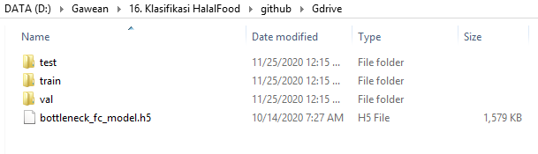
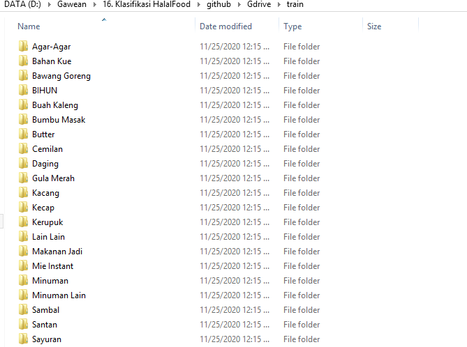
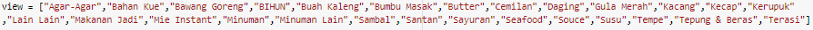
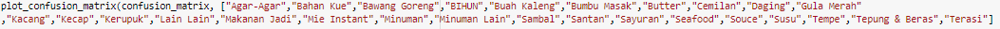
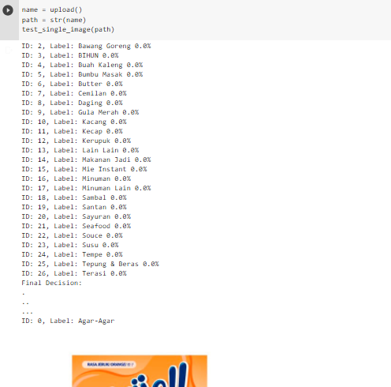
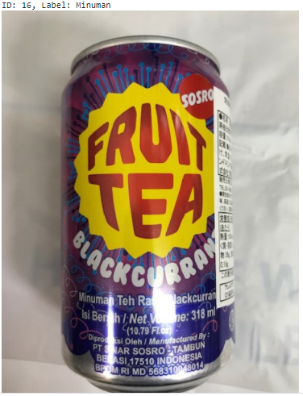

# Image Classification using VGG19 and resnet50

classification using Convolutional Neural Networks (CNNs) with VGG19 and ResNet50 as the backbone architectures. This implementation is built using Python 3, Keras, and TensorFlow, and aims to generate patterns for image classification.

CNNs are a type of neural network that are particularly well-suited for image processing tasks, as they are designed to automatically learn and extract features from input images. VGG19 and ResNet50 are both popular CNN architectures that have been shown to perform well on a variety of image classification tasks.

By using these models as the backbone architectures for image classification, it is possible to leverage their ability to learn complex features from images and use them to classify new images. The patterns generated by the model represent the learned features and are used to make predictions about the contents of new images.

Dataset (Gdrive) : https://drive.google.com/drive/folders/1bwldB0owjeroiL8kLJL0NMJHqF4dfyjk?usp=sharing

The repository includes:
* Using google Colab
* Training code for image classification with VGG 
* Jupyter notebooks to visualize the detection pipeline at every step
* Teting
* Evaluation (confussion matrix)

# Getting Started
Download this repo and dataset too, if u want use this dataset
* [VGG16_CNN.ipynb](VGG16_CNN.ipynb) this is for training your own dataset. It shows an example how to training with your own data.
* [testing_load_image.ipynb](testing_load_image.ipynb) shows how to load model. This notebook explain how to test your data with model

# Training on Your Own Dataset

1. Make sure the path like this 

make sure again about Gdrive the important one dataset must be like this

2. Upload all data to google drive ,which one matching with google colab email

3. Open google colab and use this code VGG16_CNN.ipynb, the part u must change just their class 

total lines u must change are 6 

# load model / Testing 

1. Make sure the path like this 

make sure again about Gdrive the important one dataset must be like this

2. Upload all data to google drive ,which one matching with google colab email

3. Open google colab and use this code testing_load_image.ipynb, in this codes  just run all codes 

4. Upload Photo what u want to predict

5. result like this

